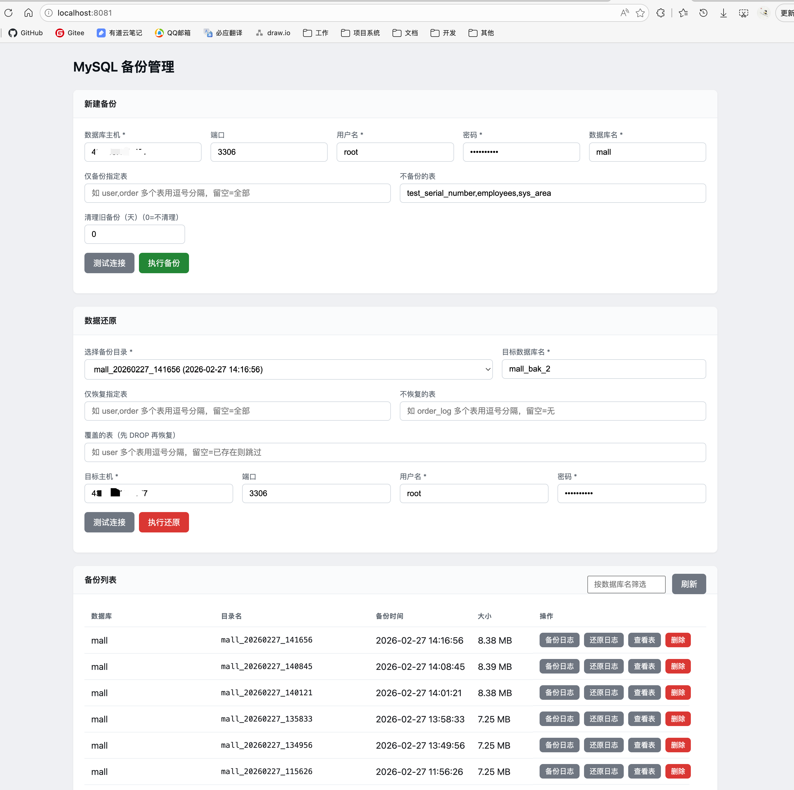
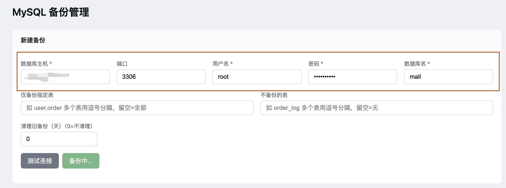
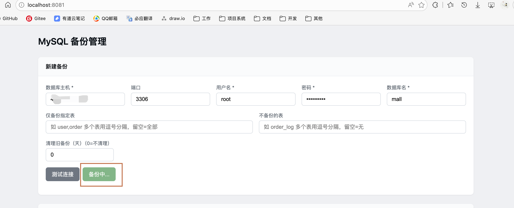
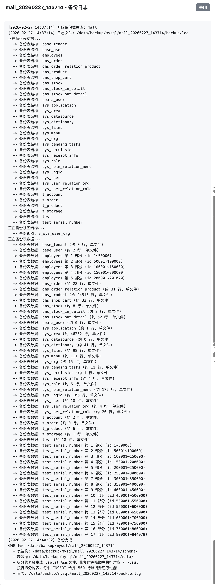
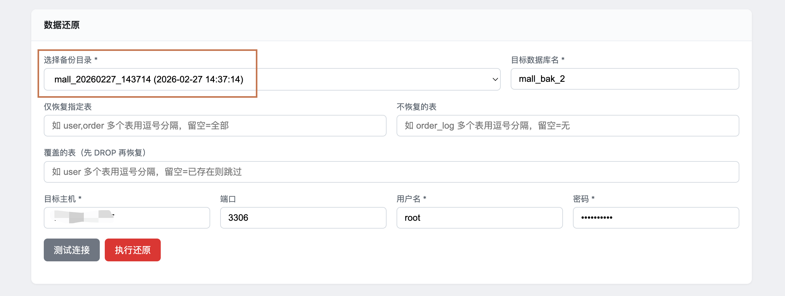
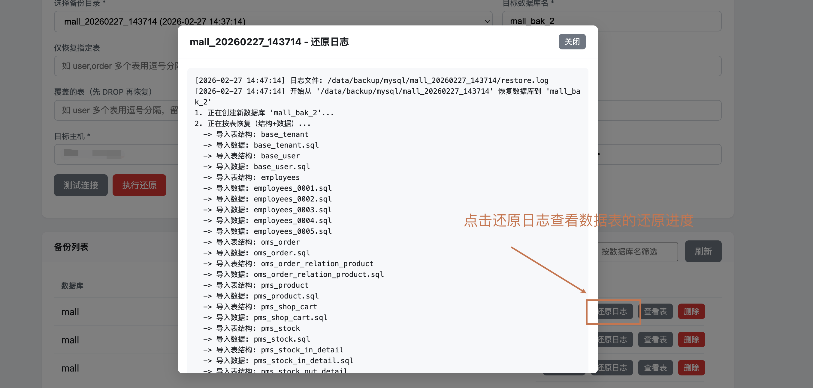

# MySQL数据库备份工具分享：让备份更智能、更高效

在日常的数据库管理中，备份是一项至关重要的工作。一个好的备份工具不仅能保证数据安全，还能提高工作效率。

## 工具简介

这款MySQL数据库备份工具是一套完整的备份解决方案，包含：
- 核心备份和恢复脚本
- 直观的Web可视化管理界面
- 智能的大表处理机制
- 完善的日志系统

通过Web界面，用户可以轻松完成备份、恢复、查看备份历史等操作，无需直接操作命令行脚本。



## 使用示例

### 1. 通过Web界面创建备份

1. **打开备份管理界面**：访问 `http://localhost:8081`（具体地址根据部署环境而定）

2. **填写备份参数**：
   - 数据库主机：输入MySQL服务器地址
   - 端口：默认3306
   - 用户名和密码：数据库登录凭据
   - 数据库名：要备份的数据库名称
   - 可选参数：
     - 仅备份指定表：输入表名，多个表用逗号分隔
     - 不备份的表：输入要排除的表名
     - 清理旧备份：设置清理多少天前的备份

   

3. **测试连接**：点击"测试连接"按钮，确保数据库连接正常

4. **执行备份**：点击"执行备份"按钮，开始备份过程

   

5. **查看备份状态**：在备份列表中查看备份进度和结果

   

   

### 2. 通过Web界面恢复数据

1. **打开备份管理界面**：访问 `http://localhost:8081`
2. **选择备份目录**：从下拉菜单中选择要恢复的备份

   
3. **填写恢复参数**：

   - 目标数据库名：恢复到的数据库名称
   - 目标主机：目标MySQL服务器地址
   - 用户名和密码：目标数据库登录凭据
   - 可选参数：
     - 仅恢复指定表：输入要恢复的表名
     - 不恢复的表：输入要排除的表名
     - 覆盖的表：输入需要覆盖的表名

   
4. **测试连接**：点击"测试连接"按钮，确保目标数据库连接正常
5. **执行还原**：点击"执行还原"按钮，开始恢复过程
6. **查看恢复状态**：通过日志查看恢复进度和结果

   

### 3. 管理备份历史

- **查看备份列表**：在Web界面的"备份列表"部分查看所有备份
- **筛选备份**：通过数据库名筛选特定备份
- **查看备份详情**：点击"查看表"按钮，查看备份包含的表和视图

  
- **查看日志**：点击"备份日志"或"还原日志"按钮，查看详细操作日志
- **删除备份**：点击"删除"按钮，删除不需要的备份

## 镜像构建与部署运行

### 构建镜像

该工具提供了Docker镜像构建支持，内置了mysql、mysqldump和Python3，方便在任何环境中快速部署：

```bash
cd db-backup-management
docker build -t db-backup-management:latest .
```

若官方源出现502，可使用国内镜像构建：

```bash
# 阿里云镜像
docker build --build-arg APT_MIRROR=aliyun -t db-backup-management:latest .

# 清华镜像
docker build --build-arg APT_MIRROR=tsinghua -t db-backup-management:latest .
```

### 挂载说明

| 容器路径 | 说明 |
|---------|------|
| `/data/backup/mysql` | 备份文件存储目录，建议挂载宿主机目录持久化 |

### 运行服务

对外提供备份与还原接口，以及可视化界面：

```bash
docker run -d -p 8081:8081 -v /宿主机/备份目录:/data/backup/mysql --name db-backup db-backup-management:latest
```

启动后，访问 `http://localhost:8081/` 即可使用Web可视化管理界面。

## 核心亮点

### 1. 智能的大表拆分机制

**传统问题**：使用mysqldump直接备份为单个SQL文件时，对于大表（如千万级数据）会生成巨大的文件，不仅占用存储空间，而且在传输和恢复时也非常耗时。

**解决方案**：该工具实现了智能的大表拆分机制：
- 当表行数超过设定阈值（默认10万行）时，自动拆分为多个SQL文件
- 优先使用主键keyset分页拆分，提高备份效率
- 对于无主键或非数值主键的表，采用按行拆分并合并INSERT语句的方式
- 每个数据文件最多包含5万行，每个INSERT语句包含500行，平衡了文件大小和恢复性能

### 2. 结构与数据分离备份

**传统问题**：传统备份工具通常将表结构和数据混合在一个文件中，不利于单独查看或恢复结构。

**解决方案**：该工具将备份文件清晰地分为两个目录：
- `schema/`：存储所有表的结构文件（包括视图）
- `data/`：存储所有表的数据文件

这种分离设计使得备份更加清晰，也方便在需要时单独恢复表结构或数据。

### 3. 灵活的表过滤功能

**传统问题**：传统备份工具要么备份整个数据库，要么需要手动指定表，不够灵活。

**解决方案**：该工具提供了强大的表过滤功能：
- 支持仅备份指定的表，多个表用逗号分隔
- 支持排除不需要备份的表
- 支持恢复时的表过滤，可选择只恢复部分表
- 支持覆盖模式，可指定覆盖已有表

### 4. 直观的Web可视化界面

**传统问题**：传统备份工具通常需要通过命令行操作，对非技术人员不友好。

**解决方案**：该工具提供了直观的Web管理界面：
- 图形化配置备份参数
- 一键执行备份和恢复操作
- 实时查看备份和恢复进度
- 方便地管理备份历史记录
- 支持测试数据库连接

### 5. 自动备份清理

**传统问题**：备份文件会随着时间积累，占用大量存储空间。

**解决方案**：该工具支持自动清理旧备份：
- 可指定清理N天前的旧备份
- 只清理当前数据库的旧备份，不会影响其他数据库的备份

### 6. 完善的日志系统

**传统问题**：传统备份工具的日志通常不够详细，不利于问题排查。

**解决方案**：该工具提供了详细的日志记录：
- 备份和恢复过程的详细日志
- 日志文件超过指定大小（默认10MB）时自动轮转备份
- 日志包含时间戳、操作步骤和结果，便于问题追踪
- Web界面实时显示日志内容

## 与传统备份方式的对比

| 特性 | 传统mysqldump | 本工具 |
|------|----------------|--------|
| 大表处理 | 生成单个大文件 | 自动拆分多个小文件 |
| 备份结构 | 结构与数据混合 | 结构与数据分离 |
| 表过滤 | 有限支持 | 灵活的包含/排除机制 |
| 恢复灵活性 | 全量恢复 | 支持选择性恢复和覆盖 |
| 旧备份清理 | 需手动处理 | 自动清理指定天数前备份 |
| 日志系统 | 简单日志 | 详细的轮转日志 |
| 恢复性能 | 单个大INSERT | 合并多行INSERT，提升性能 |
| 用户界面 | 命令行操作 | 直观的Web可视化界面 |
| 操作便捷性 | 需要记住命令参数 | 图形化配置，一键操作 |

## 技术实现亮点

1. **智能的大表拆分算法**：优先使用主键keyset分页，减少数据扫描，提高备份速度
2. **优化的恢复性能**：合并多行INSERT语句，减少网络传输和SQL解析开销
3. **完善的错误处理**：脚本包含详细的错误检查和处理逻辑
4. **响应式Web界面**：采用现代化的前端设计，适配不同设备
5. **实时日志更新**：Web界面实时显示操作日志，方便监控进度
6. **清晰的目录结构**：备份文件按结构和数据分类存储，便于管理

## 适用场景

- **生产环境**：需要定期备份大型数据库，确保数据安全
- **开发测试**：快速恢复测试数据，提高开发效率
- **数据迁移**：在不同环境间迁移数据，保持数据一致性
- **数据归档**：定期归档历史数据，优化数据库性能
- **团队协作**：通过Web界面，团队成员都能轻松操作备份和恢复

## 总结

这款MySQL数据库备份工具通过智能的设计和丰富的功能，解决了传统备份方式的诸多痛点。它不仅提供了高效、可靠的备份和恢复功能，还通过直观的Web界面，大大降低了操作门槛，使得数据库备份工作变得更加简单高效。