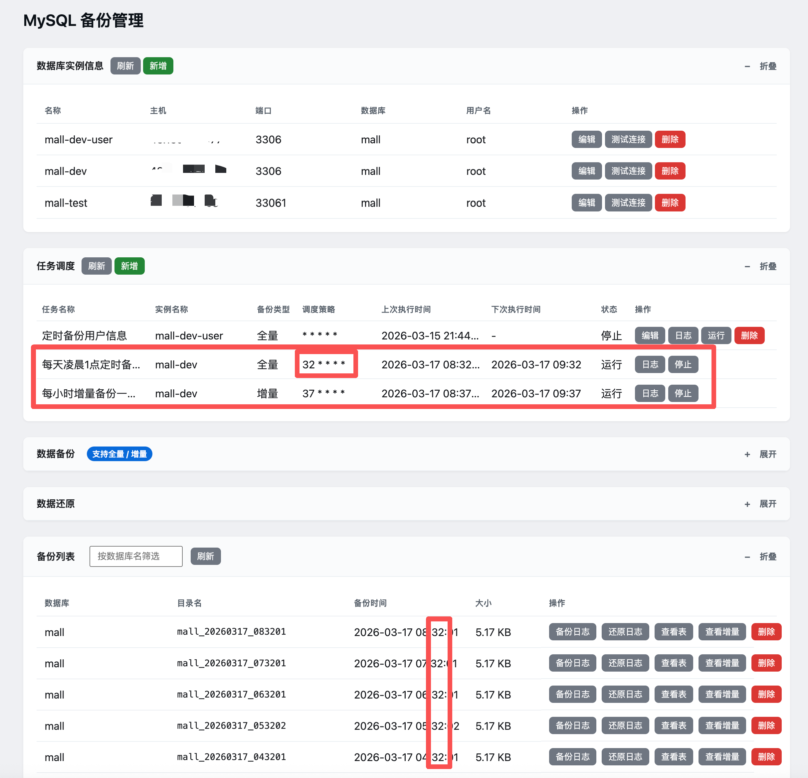
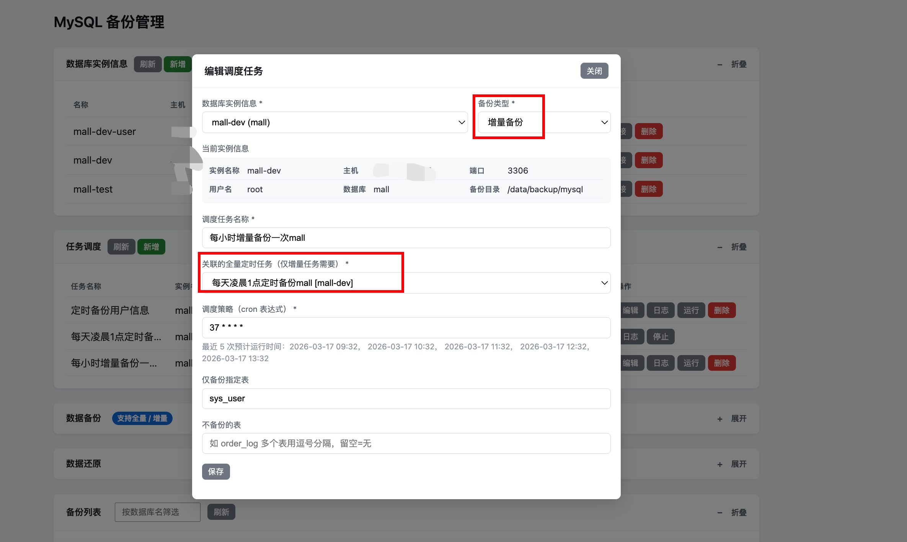
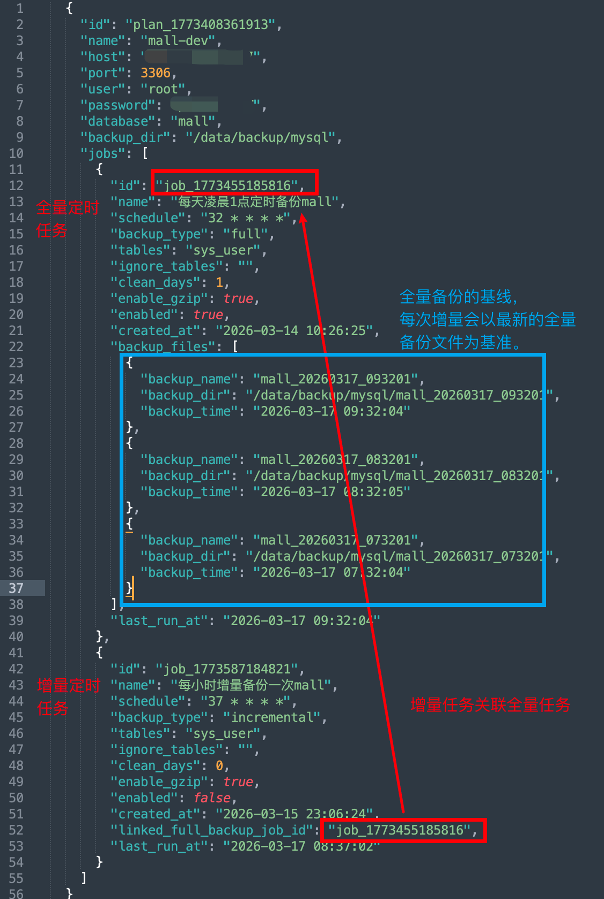
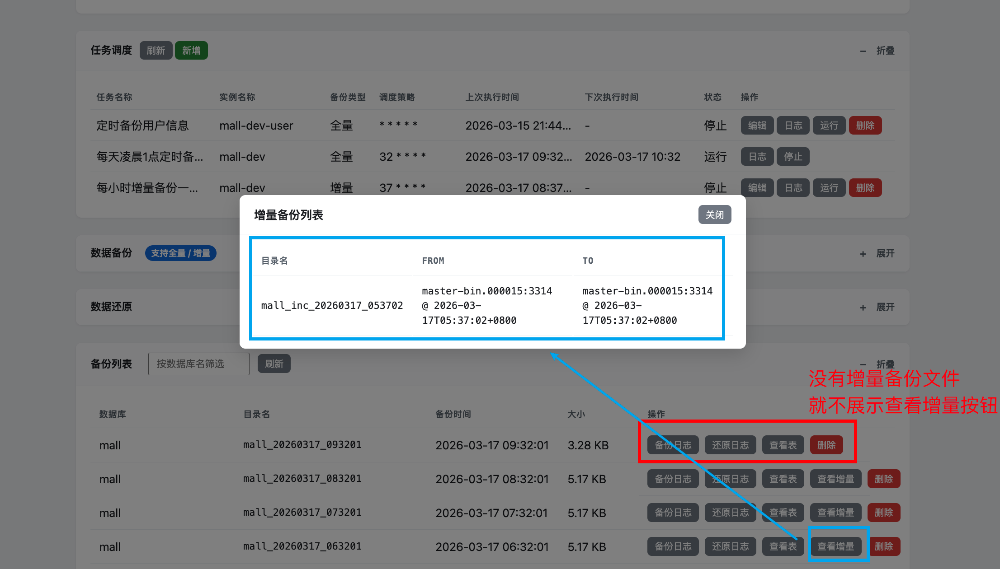

# MySQL 备份工具分享（四）：定时增量备份，让备份真正“会自己长”

在前几篇分享中，我们已经把“按需全量备份 + 手动增量备份 + Web 可视化还原 + 实例信息 + 任务调度”等能力铺好地基。

这一篇要讲的，数据备份的最后一块拼图，定时增量备份：

> **在固定时间自动跑全量备份后，让后续的增量备份也能自动、连续、可追溯地跑起来。**

本次分享介绍的就是：**定时增量备份** 功能，以及它和 **定时全量备份** 之间的精细关联。

> 支持该功能的镜像版本：**26.1.9** 或 `latest`  

---



## 一、镜像拉取与运行示例

### 1.1 拉取镜像

```bash
# 从 Docker Hub 拉取
docker pull codeyunze/db-backup-management:latest
# 或指定版本
docker pull codeyunze/db-backup-management:26.1.9

# 从阿里云 ACR 拉取（国内网络更友好）
docker pull registry.cn-guangzhou.aliyuncs.com/devyunze/db-backup-management:latest
# 或指定版本
docker pull registry.cn-guangzhou.aliyuncs.com/devyunze/db-backup-management:26.1.9
```

### 1.2 启动服务

```bash
docker run -d -p 8081:8081 \
  -v /宿主机/备份目录:/data/backup/mysql \
  --name db-backup \
  codeyunze/db-backup-management:26.1.9

# 或使用 latest
# docker run -d -p 8081:8081 \
#   -v /宿主机/备份目录:/data/backup/mysql \
#   --name db-backup \
#   codeyunze/db-backup-management:latest
```

启动后访问：

- Web UI：`http://localhost:8081/`
- 备份数据会写入宿主机挂载的 `/宿主机/备份目录` 下。

---

## 二、解决了什么问题？

在有了“全量备份 + 手动增量备份”之后，剩下的其实就是三个问题：

1. **“定时任务只做全量，增量还得人点吗？”**  
2. **“每次增量怎么知道应该基于哪次全量，以及上一次增量结束在哪？”**  
3. **“一条全量链下会不会挂一堆增量任务，最后谁跟谁都搞不清楚？”**

这次的定时增量设计，目标就是：

- **全量负责“打基线”，增量负责“顺着基线按位点往前追”**；
- 每条定时增量任务都 **显式关联一条定时全量任务**，不会乱指；
- 每条全量任务下 **只允许存在一个增量任务**，一夫一妻制，关系清晰；
- 增量的起点始终遵循：
  - 若该全量下已有历史增量：**从最后一个增量的 `binlog_to` 继续**；
  - 否则：从全量备份内记录的 `meta/tables-binlog.json` 最新位点开始。
  

可以用一条时间线来直观理解（假设数据库名为 `mall`，binlog 文件都是 `master-bin.000015`）：

1. **第一条全量基线 + 若干增量**
   - 01:00：全量任务生成 `mall_20260315_010000`，记录快照位点为 `pos=1000`；
   - 01:05：第一次增量触发，发现这个全量下还没有增量，于是从 `1000` 开始提取，生成 `inc1`，结束在 `pos=2000`；
   - 01:10：第二次增量触发，这次看到“已有 inc1，结束在 2000”，于是从 `2000` 继续，生成 `inc2`，结束在 `pos=2600`；
   - 01:15：第三次增量触发，再从 `2600` 继续，生成 `inc3`，结束在 `pos=3100`。
   - 此时这条链就是：  
     **`mall_20260315_010000` → `inc1(1000→2000)` → `inc2(2000→2600)` → `inc3(2600→3100)`**

2. **第二条全量基线 + 全新的增量链**
   - 02:00：全量任务再次执行，生成 `mall_20260315_020000`，这次快照位点是 `pos=3500`；
   - 02:05：与该全量任务关联的同一条增量任务再次触发，但此时系统会基于“最新一次全量=020000”，从 `3500` 开始提取，生成这条新全量下的 `inc1'`，结束在 `pos=4200`；
   - 02:10：下一次增量触发，从 `4200` 接着往后，生成 `inc2'`，结束在 `pos=4800`；
   - 这条新链就是：  
     **`mall_20260315_020000` → `inc1'(3500→4200)` → `inc2'(4200→4800)`  
     它和第一条链互不干扰，各自独立。**

3. **第三条全量基线（比如第二天），同样会形成第三条“全量 + 增量链”**  
   只要你在“任务调度”里让这条全量任务保持运行，增量任务就会永远追着“最近一次全量”往前滚动，每天凌晨打一条新基线，其余时间用增量把中间的变化都串起来。

所以你只需要想清楚两件事：

- 哪条任务负责“定时打一条全量基线”？  
- 这条全量任务需要多密（每天 1 次？每周 1 次？）？

剩下的，什么时候该从全量的快照位点起步、什么时候该从上一次增量的结束位点继续，**都交给时间线和 binlog 去帮你维护就好了。**

---

## 三、定时增量备份的核心设计

### 3.1 一条增量任务，只能挂在一条全量任务下面

在“任务调度”模块中，现在可以新建两种类型的任务：

- **全量备份任务（full）**
- **增量备份任务（incremental）**

新增 / 编辑增量任务时，必须：

- 选择“数据库实例信息”（哪台库）；
- 选择“备份类型 = 增量备份”；
- **从下拉框中选择“关联的全量定时任务”**。

系统会在后端做两层约束：

1. **增量任务必须指定 `linked_full_backup_job_id`**：  
   如果你试图保存一个没选基线全量任务的增量 job，会直接被 400 拒绝。
2. **同一个全量任务下，只允许存在一个增量任务**：  
   - 创建新增量任务时，如果已经有其它增量任务的 `linked_full_backup_job_id` 指向该 full job，会拒绝创建；  
   - 编辑增量任务、切换它关联的 full job 时，如果目标 full job 已经被其它增量任务占用，也会拒绝。

这样可以保证：

- 每条全量任务下最多有一个“定时增量追随者”；
- 看任何一条增量任务，都可以明确知道：**“我就是追着这条全量任务跑的”**。



### 3.2 基线全量备份是怎么选出来的？

在增量任务被触发（由 cron 或内部接口）时，后端会：

1. 通过增量任务的 `linked_full_backup_job_id` 找到关联 full job；
2. 基于 full job 对应的实例信息（`database` + `backup_dir`），从备份目录中**扫描该库的所有全量备份目录**（形如 `mall_YYYYMMDD_HHMMSS`）；
3. 选出这条全量任务最近产生的一次全量备份目录作为本次增量的基线：
   - 首选：通过定时全量脚本执行成功时回调的 `backup_files`（最多保留 20 条）；
   - 兜底：如果历史原因导致 `backup_files` 为空，则按 `database + 备份时间` 从物理目录中反推最近的那一次。

换句话说：

- **定时全量任务跑一次，就在自己的“基线候选列表”里多了一条记录**；
- 定时增量任务每次触发时，都会基于这条列表选出最新的那一条全量备份目录作为基线。

**backup-plans.json文件记录数据**



### 3.3 增量起点：连续链路保证不丢一秒

增量真正执行时，核心逻辑与手动增量一致：

1. 如果该全量目录下已经存在历史增量：
   - 找到“最后一个增量”的 `meta/binlog_to.json`；
   - 以后续的 `binlog_file` / `binlog_pos` 作为本次增量的起点；
   
   增量备份文件里的`meta/binlog_to.json`
   
   ```json
   {
     "binlog_file": "master-bin.000015",
     "binlog_pos": 3314,
     "recorded_at": "2026-03-17T06:37:02+0800",
     "database": "mall"
   }
   ```
   
   
2. 否则：
   - 从全量目录的 `meta/tables-binlog.json` 中，选出 **recorded_at 最新的那一条**；
   - 以该表快照时间对应的 binlog 位点作为起点。

再配合“每次增量结束都写回 `meta/binlog_to.json`”，就形成了：

> **全量 → inc1 → inc2 → inc3 → …**  
> 所有定时增量任务跑出来的增量备份文件，天然在同一条“链”上连续前进。

全量备份文件里的 `meta/tables-binlog.json`

```json
# sys_user是数据表名，每一个数据表都有自己的记录
{
  "sys_user": { "binlog_file": "master-bin.000015", "binlog_pos": 3314, "recorded_at": "2026-03-17T06:32:03+0800" }
}

```


---

## 四、Web 界面上的使用方式

### 4.1 在“任务调度”里配置全量与增量

1. **先配置一条全量定时任务**

   - 选择“数据库实例信息”（如 `mall-dev`）；
   - 备份类型选“全量备份”；
   - 配置：
     - 调度任务名称（如“每天 01:00 全量备份 mall”）；
     - 调度策略（如 `0 1 * * *`）；
     - “仅备份指定表 / 不备份的表”（可选，如果只想保护关键业务表）；
     - “清理旧备份（天）”（比如 7 天）；
     - “启用 gzip 压缩”（推荐保持勾选，自动生成 `.sql.gz`）。
   - 保存后处于“停止”状态，点击“运行”才会写入 crontab。

2. **再为这条全量任务挂一条定时增量任务**

   - 新建任务时：
     - 选择同一条“数据库实例信息”（如 `mall-dev`）；
     - 备份类型选“增量备份”；
     - **在“关联的全量定时任务”下拉中，选择刚刚那条全量任务**；
     - 填写：
       - 调度任务名称（如“每 5 分钟增量追踪 mall”）；
       - 调度策略（如 `*/5 * * * *`）；
     - 此时不会再出现“清理旧备份（天）”输入框，因为增量只负责记录变更，不负责物理清理；
     - “仅备份指定表 / 不备份的表”会显示为 **只读**，值来自关联的全量任务，确保两者过滤条件一致。
   - 保存后同样是“停止”状态，需要再点“运行”才会写入 crontab。

### 4.2 备份列表中的增量链展示优化

在“备份列表”模块中：

- 每一条全量备份记录右侧的“查看增量”按钮，只会在：
  - 该全量备份目录下的 `incremental/` 子目录存在增量备份记录时才展示；
  - 若尚无增量，则不显示该按钮，避免点了也看不到东西。

这样，运维可以很直观地看到：

- 哪些全量备份已经有增量链跟上；
- 每个全量备份下的具体增量分布。



---

## 五、运维友好：日志与安全保护

### 5.1 任务运行日志更易读

每条定时任务都会产生两类日志：

- 元事件日志：`/data/backup/mysql/job-logs/<job_id>.log`
  - 记录：创建任务、修改 cron、启停状态、每次调度触发、执行成功/失败原因；
- 运行输出日志：`/data/backup/mysql/job-logs/<job_id>.run.log`
  - 记录真实的备份脚本 stdout/stderr，便于深入排查。

在 Web “任务调度”里点击“日志”，看到的是这两类内容的合并视图，更适合日常运维阅读。

### 5.2 删除 / 禁用任务的保护

- **删除全量任务**：
  - 若仍有增量任务的 `linked_full_backup_job_id` 指向该 full job，会拒绝删除，并提示要先处理增量任务；
  - 避免“增量任务还在跑，却失去了基线全量任务”的混乱场景。
- **停止全量任务**：
  - 不再强制要求先处理增量任务，可以自由暂停，这在调参或做变更窗口时尤其有用。

---

## 六、小结：让备份从“被动动作”变成“持续时间线”

有了这次的定时增量备份功能，你大概可以这样规划一条完整的备份时间线：

- 每天凌晨 01:00 —— 全量备份一次，打一个“干净基线”，并按策略自动清理过期的旧全量；
- 每隔 5 分钟 —— 增量备份一次，基于最新一次全量 + 已有增量链的末端位点，持续记录变更；
- 真正需要回溯时：
  - 选中某次“基线全量备份目录”；
  - 选中需要恢复到的“增量节点”；
  - 工具会自动完成“全量 + 该全量之后至该增量节点的所有增量”的组合还原。

**你不再需要记住“那天凌晨我打了哪次全量”、“这几次增量是基于哪个点开始的”** ——  
这些统统交给定时全量/增量任务、元数据与 Web 界面去表达，你只需要关注一个问题：

> “我要把这套库恢复到哪个时间点？”  

从 26.1.9 开始，这个问题终于有了一个愉快的、自动化的答案。  
