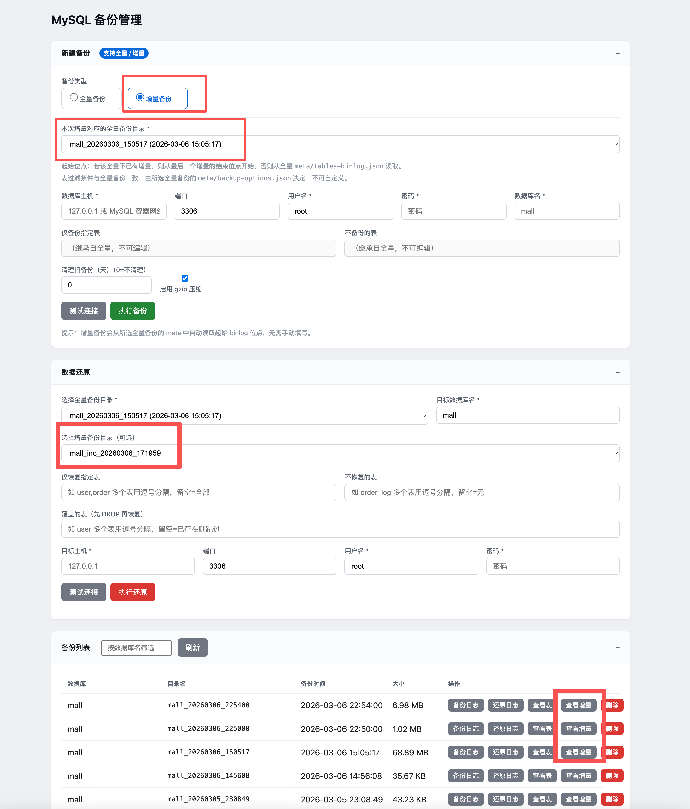
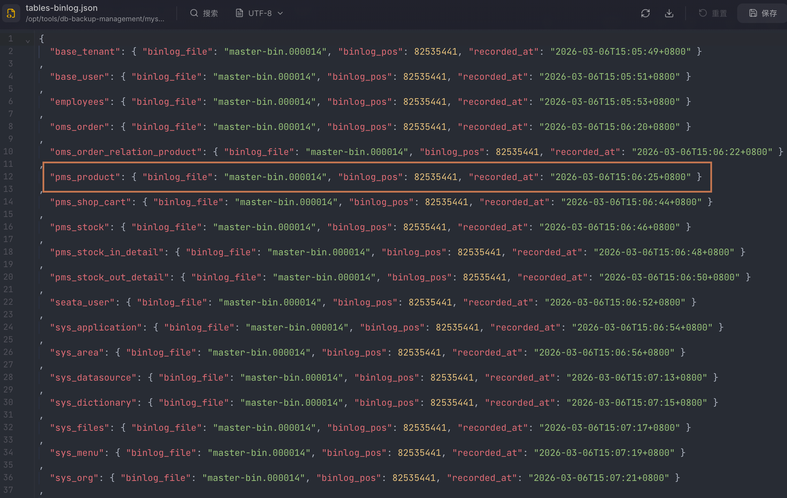
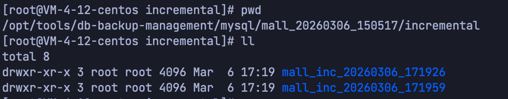
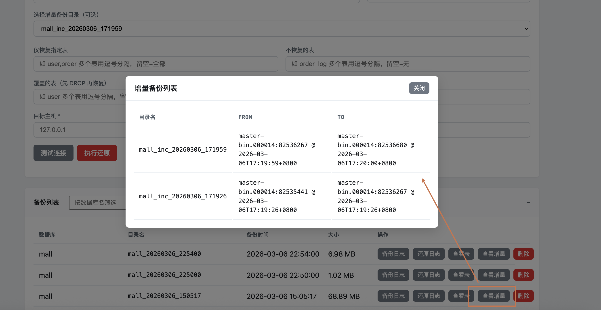
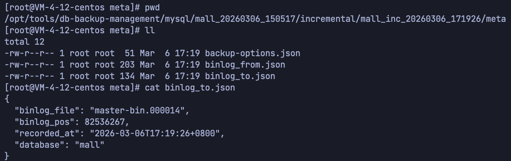
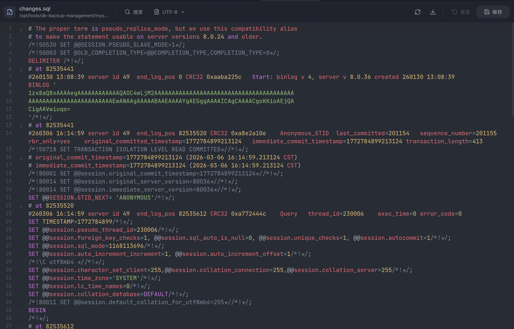

# MySQL 备份工具分享（二）：增量备份功能

在上一篇分享中，我们介绍了这款 MySQL 数据库备份工具的全量备份能力：智能大表拆分、结构与数据分离、表过滤、Web 可视化界面等。

本篇在此基础上，专门介绍 **本次新增的增量备份功能** ：如何在全量备份之后形成连续的增量链，如何恢复“全量 + 若干增量”到指定时间点的数据状态，以及使用时的注意事项。

---

## 一、为什么需要增量备份

全量备份适合作为**基线快照**，但在数据量较大或备份频率较高时，每次都做全量会带来：

- **时间长**：大库全量备份耗时明显；
- **占空间**：多次全量会占用大量磁盘；
- **恢复粒度粗**：只能恢复到某次全量完成的时间点，无法精确到“全量之后的某个时刻”。

增量备份则是在**某次全量之后**，只记录“从上一备份结束到当前”的数据变更（基于 MySQL binlog），从而：

- **缩短单次备份时间**：只抓取变更片段；
- **节省存储**：增量文件通常远小于全量；
- **提高恢复灵活性**：可以选“全量 + 到某个增量为止”，得到更接近目标时间点的数据。

本工具在保留原有全量能力的前提下，新增了基于 binlog 的增量备份与组合恢复，与全量形成一条清晰的**备份链**。

---

## 二、增量备份是怎么工作的

### 2.1 全量备份时记录的“起点”

本工具的全量备份是**按表**进行的：每张表在自己的 `mysqldump --single-transaction` 一致性快照中完成备份。因此，每张表完成快照的时刻可能略有不同。为了后续增量能正确衔接，全量备份会在**每张表备份前**记录当时 MySQL 的 binlog 位点（文件名 + 位置），并写入该次全量备份目录下的 `meta/tables-binlog.json`。

这样，我们就有了“这次全量备份对应的 binlog 起点”的精确信息，为后续增量提供了基准。

### 2.2 增量备份：从“上一结束点”到“当前”

- **第一次增量**：从该全量备份的 `meta/tables-binlog.json` 中选取**最新的位点**作为起点，调用 `mysqlbinlog` 从该起点拉取到当前，生成一份 `changes.sql`，并记录本次的起止位点到 `meta/binlog_from.json`、`meta/binlog_to.json`。
- **后续增量**：从**该全量下已有增量的最后一个**的 `meta/binlog_to.json` 读取结束位点，作为本次增量的起点，再拉取到当前，形成连续链：

  **全量 → 增量1 → 增量2 → 增量3 → …**

每次增量都会在对应全量备份目录下创建子目录，例如：

`<全量备份目录>/incremental/<数据库名>_inc_YYYYMMDD_HHMMSS/`

其内包含：

- `changes.sql`：本段 binlog 解析出的 SQL 变更（已按数据库过滤）；
- `meta/binlog_from.json`：起始位点与时间；
- `meta/binlog_to.json`：结束位点与时间。

增量备份的**表过滤条件**（仅备份哪些表、排除哪些表）与所属全量备份完全一致，由全量目录下的 `meta/backup-options.json` 决定，不可在增量时修改，以保证与全量数据范围一致。

change.sql文件信息

### 2.3 恢复时：“全量 + 到所选增量为止”的组合恢复

当用户选择**某次全量 + 某个增量节点**进行恢复时，工具会：

1. 先使用该全量备份执行一次**全量恢复**（与仅全量恢复的逻辑一致）；
2. 再在该全量目录下，按时间顺序找到**从第一个增量到用户所选增量（含）**的所有增量目录；
3. 依次执行每个增量目录中的 `changes.sql`，将期间的 DML 变更回放进去。

这样，最终得到的数据状态 = 全量完成时的数据 + 直到所选增量结束时的所有变更，实现“恢复到该增量对应时间点”的效果。

由于 MySQL binlog 的语义限制，当前版本的增量恢复**仅支持将数据还原到与备份时相同的数据库名**（例如备份的是 `mall`，恢复目标也必须是 `mall`）。在 Web 界面中，若填写的目标数据库名与增量所属库名不一致，会禁用“执行还原”按钮并给出提示，避免误用。

---

## 三、如何通过 Web 界面使用增量备份

### 3.1 创建增量备份（衔接全量）

1. 先完成至少一次**全量备份**（参见上一篇分享的“创建全量备份”步骤）。
2. 在“新建备份”区域，将备份类型切换为 **“增量备份”**。
3. 在 **“本次增量对应的全量备份目录”** 下拉框中选择要基于哪次全量做增量（列表来自“备份列表”中的全量备份）。
4. 确认数据库主机、端口、用户名、密码、数据库名与全量一致（增量会沿用全量的表过滤条件，界面会展示为只读）。
5. 点击 **“执行备份”**。  
   - 若是该全量下的**第一次增量**，起点自动取该全量的 `meta/tables-binlog.json` 中的最新位点。  
   - 若该全量下**已有增量**，起点自动取**最后一个增量的结束位点**，无需手动填 binlog 文件与位置。
6. 在“备份列表”中对应全量备份那一行，点击 **“查看增量”**，可看到该全量下的所有增量记录及起止时间、位点信息。

### 3.2 恢复“全量 + 增量”

1. 在“数据还原”区域，**选择全量备份目录**（必选）。
2. 如需要恢复到“全量 + 某次增量”的状态，在 **“选择增量备份目录（可选）”** 中选择目标增量节点；不选则仅恢复全量。
3. **目标数据库名** 必须与备份时的数据库名一致（例如都为 `mall`），否则“执行还原”按钮会置灰并提示。
4. 填写目标主机、端口、用户名、密码后，可先“测试连接”，再点击 **“执行还原”**。
5. 工具会先执行全量恢复，再按顺序回放从第一个到所选增量（含）的所有 `changes.sql`，全程日志写入该全量目录下的 `restore.log`，便于排查。

---

## 四、使用增量备份的注意事项

1. **MySQL 需开启 binlog**  
   增量依赖 MySQL 的 binlog，且推荐使用 ROW 格式。备份账号需具备读取 binlog 的权限（如 `REPLICATION SLAVE` 或等价权限）。

2. **binlog 保留时间要覆盖需求**  
   若 binlog 已被清理或过期，对应时间段的增量将无法再生成或回放。请根据备份策略合理设置 `binlog_expire_logs_seconds` 或等效参数。

3. **增量与全量一一对应**  
   每条增量链必须从某一次全量开始，且表过滤条件与全量一致。删除全量备份时，其下的增量目录会一并失效，需在界面上或文档中注意说明。

4. **增量恢复仅支持“同名库”**  
   当前实现下，增量还原只能还原到与备份时相同的数据库名，以保证 binlog 回放语义正确。若需还原到其他库名，可先还原到同名库，再通过库级迁移或复制到目标库。

5. **全量 + 增量的恢复顺序**  
   恢复时务必使用本工具提供的“全量 + 至某增量”的组合恢复流程，不要手动乱序执行 `changes.sql`，否则可能导致数据不一致。

---

## 五、与全量备份分享的衔接小结

- **上一篇**介绍了全量备份：大表拆分、结构/数据分离、表过滤、Web 操作、日志与清理等。  
- **本篇**在此基础上，说明了**增量备份**：  
  - 全量如何记录 binlog 起点；  
  - 增量如何从“上一结束点”连续生成；  
  - 如何在 Web 上创建增量、查看增量列表，以及如何执行“全量 + 到某增量为止”的组合恢复；  
  - 使用时的前置条件与注意点。

两者结合后，可以形成“**定期全量 + 高频增量**”的备份策略：全量作为基线，增量节省时间和空间，恢复时按需选择“全量”或“全量 + 若干增量”，在保证数据安全的前提下，提高备份与恢复的效率和灵活性。
