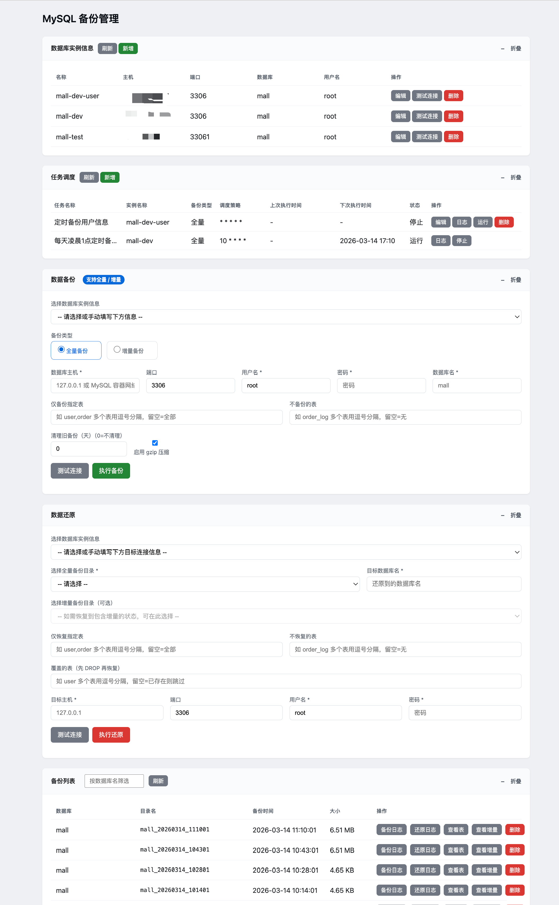
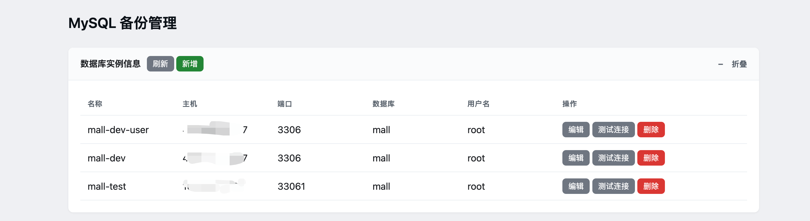
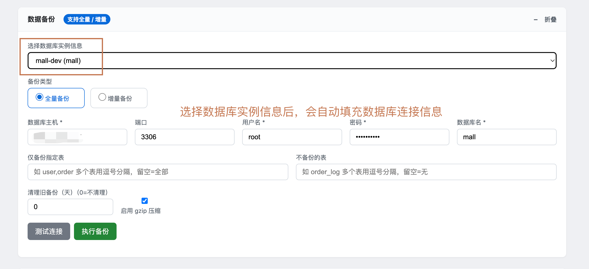
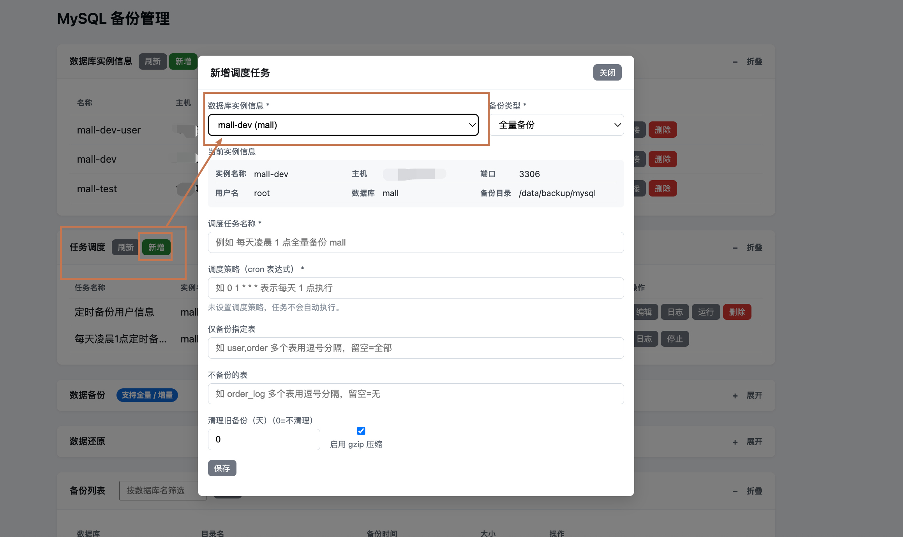
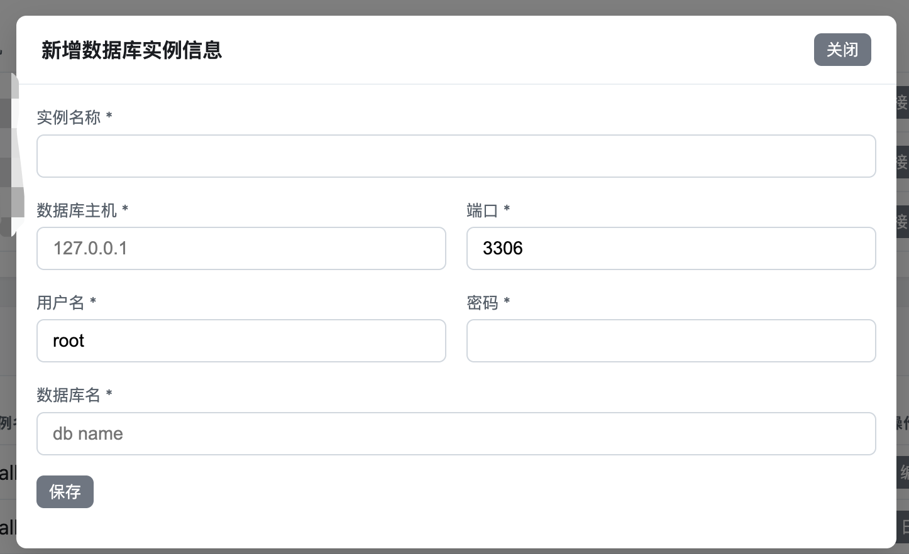
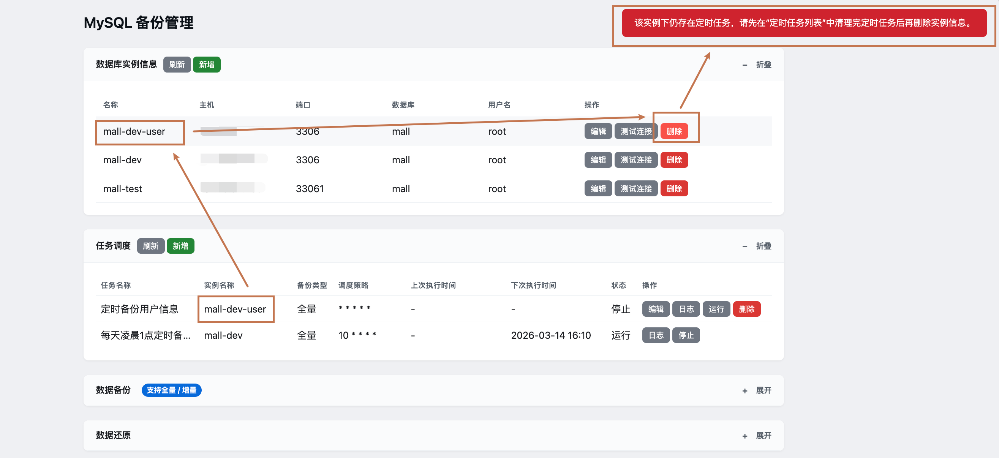
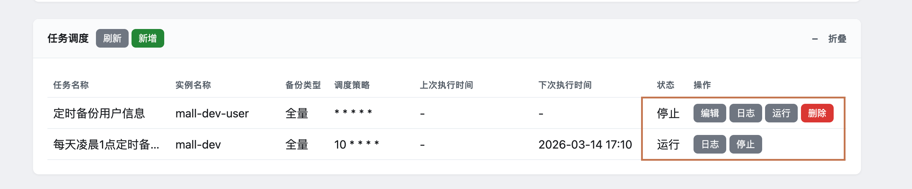

# MySQL 备份工具分享（三）：定时任务调度

在前两篇分享中，我们介绍了全量备份、增量备份以及通过 Web 界面进行备份与恢复的操作。

本篇介绍本阶段新增的两个能力：**数据库实例信息** 与 **任务调度**。

前者用于集中管理多套数据库连接配置，在操作备份与还原时，无需再重复填写数据库的连接信息。任务调度则用于基于这些实例配置定时全量备份任务（增量定时备份还在开发中），由系统 crontab 按 cron 表达式自动执行。

> 注意：因为工具内涉及到的都是数据库相关敏感信息与数据，所以建议该工具在内网安全环境使用，以防数据库连接信息与备份数据泄露。（后续会逐步开发相关安全校验功能）


支持的docker镜像版本为26.1.8

```shell
# 从 Docker Hub 拉取
docker pull codeyunze/db-backup-management:latest
# 或
docker pull codeyunze/db-backup-management:26.1.8

# 从阿里云 ACR 拉取（国内网络更友好）
docker pull registry.cn-guangzhou.aliyuncs.com/devyunze/db-backup-management:latest
# 或
docker pull registry.cn-guangzhou.aliyuncs.com/devyunze/db-backup-management:26.1.8
```

---



## 一、数据库实例信息

### 1.1 功能目的

- **统一管理连接配置**：将常用的数据库连接（主机、端口、用户名、密码、数据库名）保存为一条条“实例”，并为之命名（如 `mall-dev`、`mall-prod` 、`XXX测试环境数据库` 等）。

  
- **复用与快速填充**：在“数据备份”模块中，可从下拉框选择某条实例，自动带出主机、端口、用户名、密码、数据库名，无需每次手输。

  
- **与任务调度联动**：每条实例下可挂载多条“定时任务”；删除实例前需先清理其下所有定时任务。

  

  

​	

实例信息仅用于连接与参数填充，不包含备份策略（如是否 gzip、表过滤、清理天数等），这些策略在“数据备份”中按次填写，或在“任务调度”中按任务配置。

### 1.2 界面与操作

- **列表**：展示已保存的实例，列包括：名称、主机、端口、数据库、用户名；列表中不展示密码。
- **新增**：点击头部“新增”按钮，在弹窗中填写：实例名称、数据库主机、端口、用户名、密码、数据库名，保存后写入 `backup-plans.json`。

  
  
  


- **编辑**：点击某行的“编辑”，在弹窗中修改上述字段。
- **测试连接**：点击“测试连接”，用该实例当前保存的连接参数请求后端 `/db/test-connection`，用于确认网络与账号可用；测试时会拉取含密码的完整实例信息再发起请求。
- **删除**：点击“删除”时，若该实例下存在定时任务，会提示“该实例下仍存在定时任务，请先在任务调度中清理完定时任务后再删除实例信息”，并禁止删除；无任务时方可删除。

  

### 1.3 数据存储

- **文件**：与备份元数据同目录下的 `backup-plans.json`（默认路径由 `BACKUP_ROOT` 决定，如 `/data/backup/mysql/backup-plans.json`）。
- **结构**：根节点为数组，每项为一条“计划”，对应一条数据库实例信息，例如：

```json
{
  "id": "plan_1773382601991",
  "name": "mall-dev",
  "host": "127.0.0.1",
  "port": 3306,
  "user": "root",
  "password": "***",
  "database": "mall",
  "backup_dir": "/data/backup/mysql",
  "jobs": []
}
```

- **说明**：`id` 由系统生成，用于前后端与“任务调度”关联；`jobs` 为该实例下的定时任务列表，见下文。

---

## 二、任务调度

### 2.1 功能目的

- **定时全量备份**：选择一条已保存的“数据库实例”，配置备份类型（当前为全量）、表过滤、清理策略、是否 gzip、以及 **cron 表达式**，保存为一条“调度任务”。
- **运行 / 停止**：任务可处于“运行”或“停止”状态。运行状态下，系统会将对应命令写入 crontab，到点自动执行备份脚本；停止则从 crontab 中移除，不再触发。
- **与“数据备份”分离**：“数据备份”模块只做“立即执行一次备份”，不包含调度任务名称、cron 等；所有定时相关配置均在“任务调度”中完成。

### 2.2 界面与操作

- **列表**：表格列包括：任务名称、实例名称、备份类型、调度策略（cron 表达式）、上次执行时间、下次执行时间、状态（运行/停止）、操作。
  
  - 当状态为“运行”时，会根据 cron 表达式计算并展示“下次执行时间”；操作列显示“停止”“日志”。
  - 当状态为“停止”时，操作列显示“编辑”“日志”“运行”“删除”。
  
  
  
- **新增**：点击“新增”，在弹窗中：
  - 选择“数据库实例信息”（必选），选择后会展示该实例的当前实例信息（两行：实例名称/主机/端口，用户名/数据库/备份目录）；
  - 选择备份类型（全量/增量，当前调度仅使用全量）；
  - 勾选是否“启用 gzip 压缩”（默认勾选）；
  - 填写“调度任务名称”、“调度策略（cron 表达式）”，界面会展示最近 5 次预计执行时间；
  - 可选填写“仅备份指定表”、“不备份的表”、“清理旧备份（天）”；
  - 保存后创建一条处于“停止”状态的任务，需再点击“运行”才会写入 crontab 并开始按点执行。
  
- **编辑**：仅当任务为“停止”时可编辑；点击“编辑”打开与新增相同的弹窗，可修改任务名称、调度策略、表过滤、清理天数、gzip、以及**所属数据库实例**（切换实例相当于“迁移”任务：在新实例下创建新任务并删除原任务）。

- **运行 / 停止**：运行即把该任务加入 crontab；停止即从 crontab 移除。运行中不可编辑、不可删除。

- **日志**：点击“日志”，弹窗展示该任务的合并日志（元事件日志 + 脚本输出日志），便于排查定时执行情况。

- **删除**：仅“停止”状态下可删除；删除后从 `backup-plans.json` 中移除该 job，并从 crontab 中移除对应行（若曾在运行状态则先停止再删）。

### 2.3 调度策略（cron 表达式）

- **格式**：标准 5 段 cron：分 时 日 月 周（如 `0 1 * * *` 表示每天 1 点 0 分执行）。
- **预览**：在新增/编辑弹窗中填写调度策略后，会实时计算并显示“最近 5 次预计运行时间”，便于确认是否符合预期。

### 2.4 数据存储与 crontab 联动

- **存储**：每条调度任务作为对应实例下的一个 `job` 对象，保存在 `backup-plans.json` 的 `plans[].jobs[]` 中，例如：

```json
{
  "id": "job_1773394757637",
  "name": "每天凌晨1点全量备份mall数据库",
  "schedule": "0 1 * * *",
  "backup_type": "full",
  "tables": "",
  "ignore_tables": "",
  "clean_days": 0,
  "enable_gzip": true,
  "enabled": true,
  "created_at": "2026-03-13 17:39:17"
}
```

- **运行态**：当某条任务的 `enabled` 为 `true` 时，后端会：
  - 在 `jobs/` 目录下生成可执行脚本 `{job_id}.sh`，内容为带完整参数的 `mysql-backup-schema-data.sh` 调用（主机、端口、用户、密码、库名、表过滤、清理天数、是否 gzip 等）；
  - 在系统 crontab 中写入一行，按 `schedule` 执行该脚本；
  - 脚本执行时会将“调度触发”等元事件写入 `job-logs/{job_id}.log`，将备份脚本的标准输出写入 `job-logs/{job_id}.run.log`。
- **停止态**：`enabled` 为 `false` 或任务被删除时，从 crontab 中移除对应行，不再触发。

### 2.5 使用流程小结

1. 在“数据库实例信息”中新增并保存至少一条实例（名称、主机、端口、用户、密码、数据库名）。
2. 在“任务调度”中点击“新增”，选择该实例，填写任务名称、cron、表过滤与清理策略等，保存（此时任务为“停止”）。
3. 在任务列表中对该任务点击“运行”，系统写入 crontab，到点自动执行全量备份。
4. 需要暂停时点击“停止”；需要修改时先停止再编辑；可通过“日志”查看每次触发的记录与脚本输出。


## 三、镜像构建与部署运行

### 3.1 优先方式：直接拉取已发布镜像

推荐直接使用已发布的多架构镜像（同时支持 amd64 / arm64），无需本地构建：

```bash
# 从 Docker Hub 拉取
docker pull codeyunze/db-backup-management:latest

# 从阿里云 ACR 拉取（国内网络更友好）
docker pull registry.cn-guangzhou.aliyuncs.com/devyunze/db-backup-management:latest
```

运行服务示例（任选其一镜像地址）：

```bash
docker run -d -p 8081:8081 \
  -v /宿主机/备份目录:/data/backup/mysql \
  --name db-backup \
  codeyunze/db-backup-management:latest
```

启动后，访问 `http://localhost:8081/` 即可使用 Web 可视化管理界面。

### 3.2 如需自行构建镜像

该工具也支持本地构建 Docker 镜像，内置 mysql、mysqldump 和 Python3，方便在任何环境中快速部署：

拉取代码到本地，代码地址: https://github.com/codeyunze/db-backup-management.git

```bash
cd db-backup-management
docker build -t db-backup-management:latest .
```

若官方源出现502，可使用国内镜像构建：

```bash
# 阿里云镜像
docker build --build-arg APT_MIRROR=aliyun -t db-backup-management:latest .

# 清华镜像
docker build --build-arg APT_MIRROR=tsinghua -t db-backup-management:latest .
```

### 3.3 挂载说明

| 容器路径             | 说明                                       |
| -------------------- | ------------------------------------------ |
| `/data/backup/mysql` | 备份文件存储目录，建议挂载宿主机目录持久化 |

### 3.4 运行服务（本地构建镜像方式）

如果选择本地构建镜像，可使用以下命令运行服务：

```bash
docker run -d -p 8081:8081 \
  -v /宿主机/备份目录:/data/backup/mysql \
  --name db-backup \
  db-backup-management:latest
```

启动后，访问 `http://localhost:8081/` 即可使用 Web 可视化管理界面。

---

以上即为本阶段“数据库实例信息”与“任务调度”的分享内容；后续若增加增量任务的定时调度或更多策略，会在此基础上扩展。
