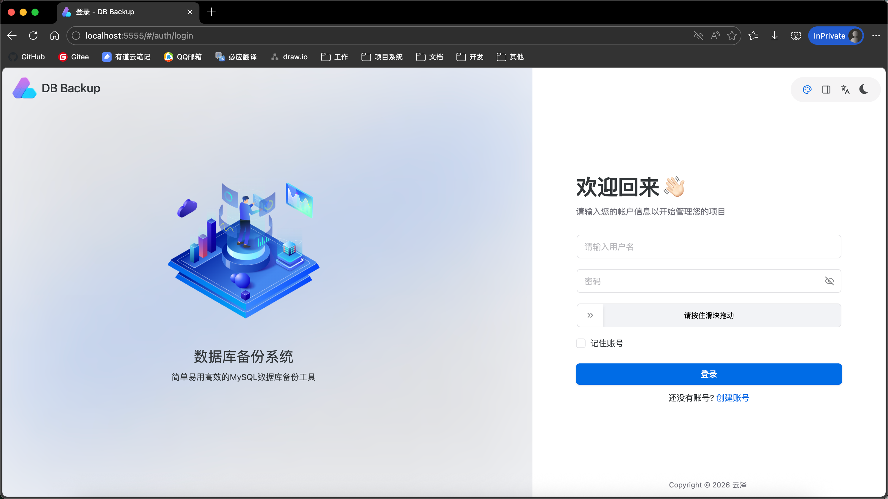
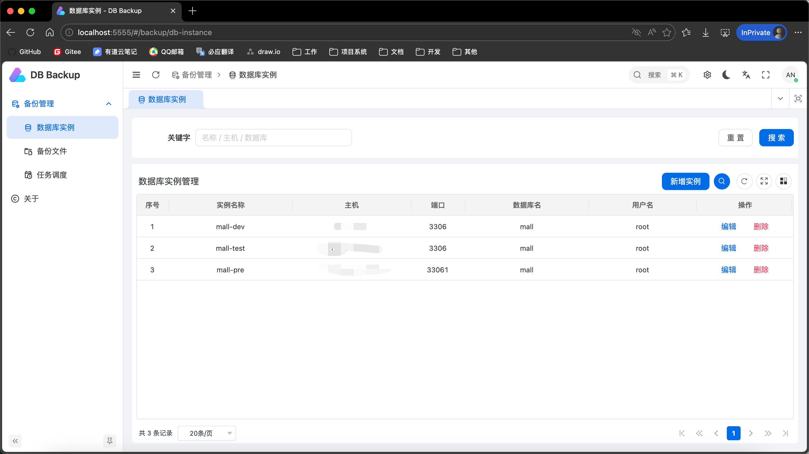
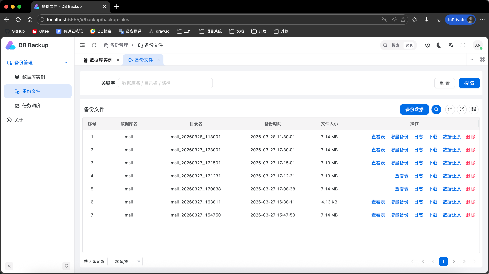
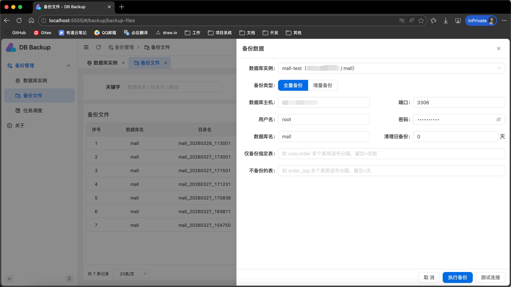
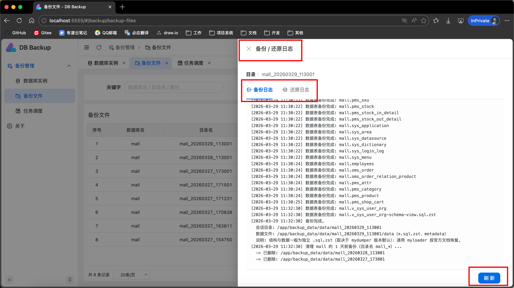
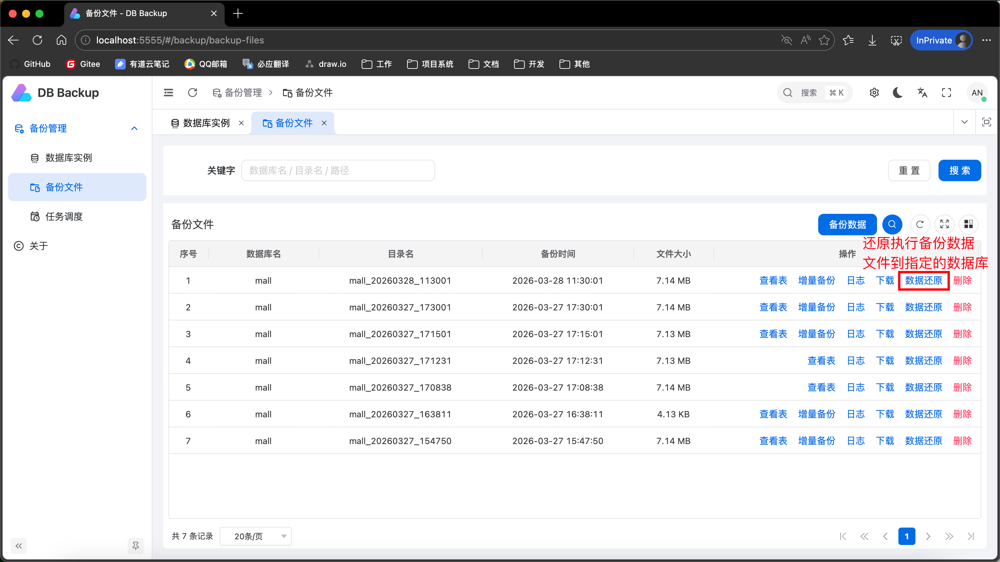
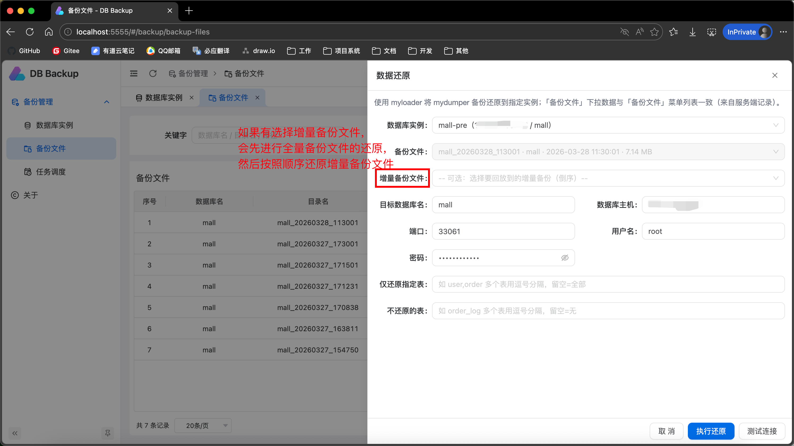
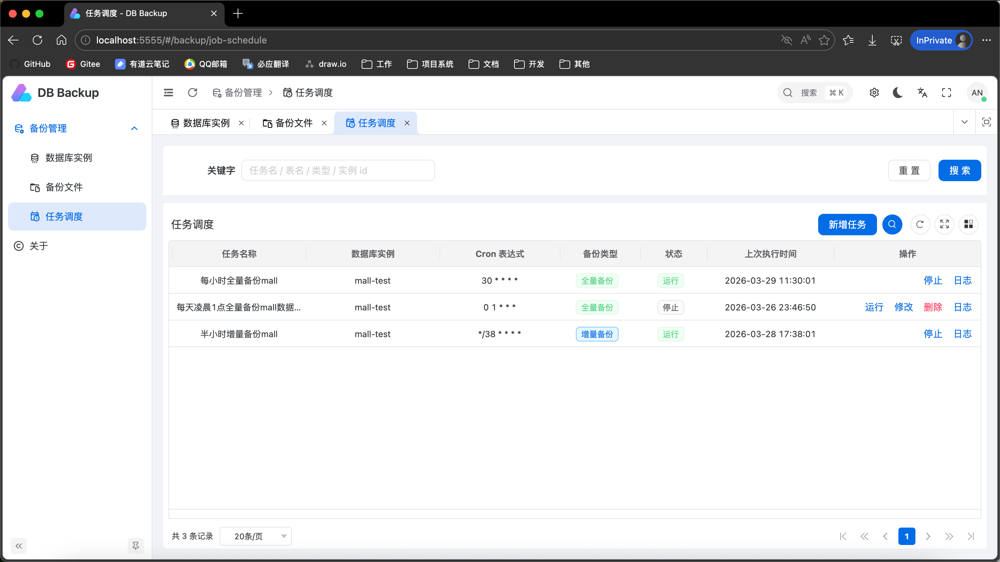

# MySQL 备份工具分享（五）：备份

> **概要：** 从单用户工具迈向可登录、多账号隔离的平台；备份底层换 mydumper，全量/增量与任务调度分模块承载，持久化结构更清晰，Docker 一键部署即可用。

## 一、本次升级解决了什么问题

旧版本主要有三个问题：缺少完整登录与数据隔离、`mysqldump` 在中大型库表场景效率有限、持久化记录数据结构不够清晰。

这次升级的目标很明确：从“能用”升级到“好用、稳定、可扩展”。 **前端更美观、系统支持登录鉴权、备份底层由 `mysqldump` 升级到 `mydumper`、持久化数据结构更清晰。**

---

## 二、核心升级亮点

## 1) 前端体验升级：界面更现代、操作更顺手

- 使用Vben Admin前端框架，视觉与布局统一，信息层级更清楚
- 备份、还原、实例、调度等核心流程交互更一致

## 2) 登录与鉴权能力补齐：系统更安全

- 系统支持登录鉴权，接口访问受登录态控制
- 备份相关数据按账号隔离，查询与操作仅作用于本人数据

这意味着系统从单用户工具，正式迈向多用户协同的管理平台。



## 3) 备份底层架构升级：`mysqldump` -> `mydumper`

切换到 `mydumper` 后，备份性能与可维护性都有明显提升：

- 多线程备份，速度更稳定
- 文件按对象拆分，排障与精细恢复更方便
- 更适配“全量 + 增量（binlog）”的备份架构

简而言之：在中大型库场景下更稳、更快。 mydumper的效率大概是mysqldump的4~5倍。

## 4) 持久化数据结构更清晰：管理成本更低

本次对持久化 JSON 结构做了系统梳理，重点是“字段标准化 + 关系明确化”：

- 账号信息：`account.json`
- 数据库实例：`db-instances.json`
- 任务调度：`backup-jobs.json`
- 备份文件记录：`backup-files.json`

数据结构更清晰之后，前后端协作、问题定位、历史兼容与后续扩展都更容易。

---

## 三、系统功能总览

当前系统提供以下核心能力：

- **数据库实例管理**
  - 维护主机、端口、用户、库名等连接信息
  - 支持连接测试，减少误操作
  
  

- **备份文件管理**
  
  - 查看全量备份列表与详情
  - 按全量备份查看对应增量记录
  - 查看备份日志、下载与删除备份
  
  

- **数据备份**
  
  - 支持全量备份
  - 支持基于 binlog 的增量备份（依赖全量基线）
  - 支持按表白名单/黑名单过滤

  
  
  
  
  备份文件的操作列上有日志按钮，可以查看备份进度日志，和还原进度日志
  
  
  
- **数据还原**
  - 支持仅全量还原
  - 支持“全量 + 增量链”顺序回放还原
  
  
  
  
- **任务调度**
  
  - 配置定时全量/增量任务
  - 支持任务启停、执行、日志追踪
  
  

---

## 四、部署方式

## 1) 直接拉取运行镜像（推荐）

```bash
# Docker Hub
# 拉取镜像
docker pull codeyunze/db-backup-management:26.2.1
# 运行镜像
docker run -d -p 5555:5555 --name db-backup -v "/宿主机/备份目录/backup_data:/app/backup_data" codeyunze/db-backup-management:26.2.1

# 阿里云 ACR
docker pull registry.cn-guangzhou.aliyuncs.com/devyunze/db-backup-management:26.2.1
# 运行镜像
docker run -d -p 5555:5555 --name db-backup -v "/宿主机/备份目录/backup_data:/app/backup_data" registry.cn-guangzhou.aliyuncs.com/devyunze/db-backup-management:26.2.1
```

启动后访问：`http://localhost:5555/`

默认账号：admin

默认密码：123456

也可自行注册其他账号

## 2) 本地构建镜像

```bash
cd db-backup-management
docker build -t db-backup-management:latest .
```

---

## 五、总结

这次大更新，不只是“界面换新”，而是从架构到数据模型的一次升级：

- 前端更美观，操作体验更统一
- 登录与账号隔离补齐，安全性更强
- 备份引擎升级到 `mydumper`，性能与稳定性更好
- 持久化结构更清晰，为后续功能扩展打下基础

如果你正在寻找一套**可视化、支持全量+增量、可调度、可多账号隔离**的 MySQL 备份管理方案，这个版本的工具基本可以满足你的日常工作需求。
